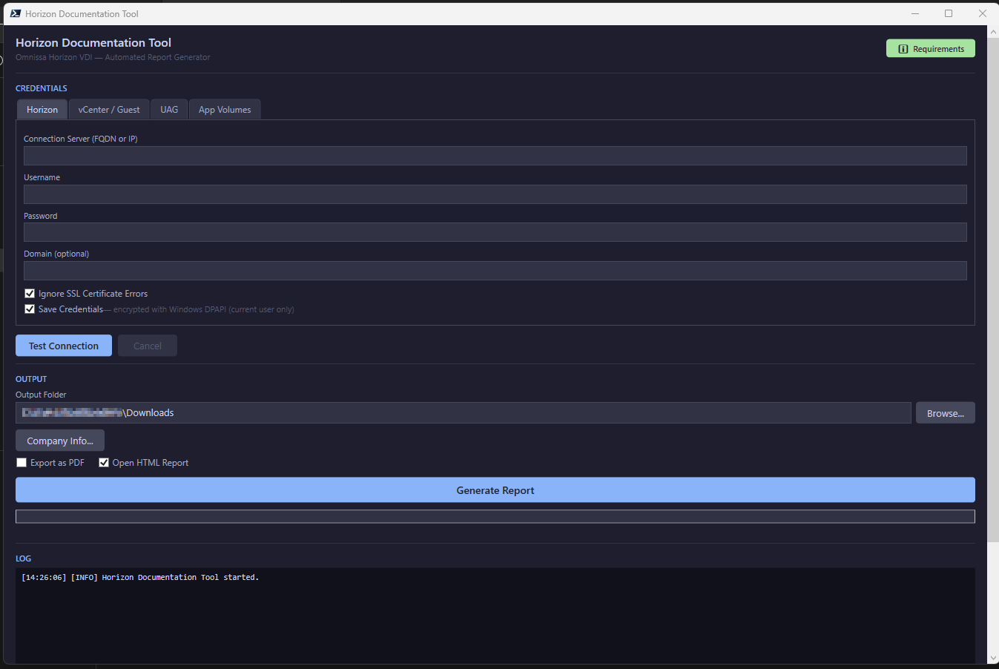
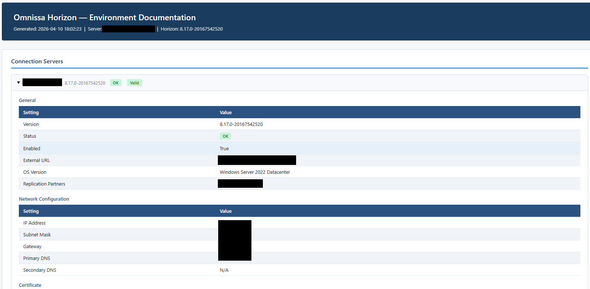
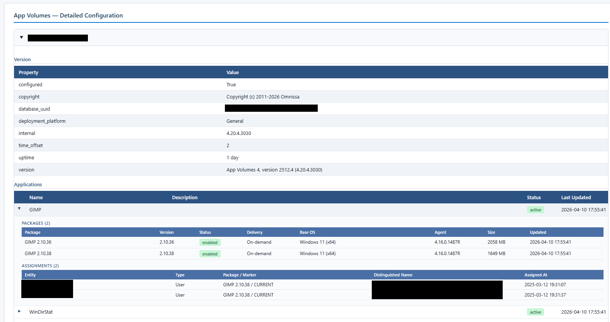
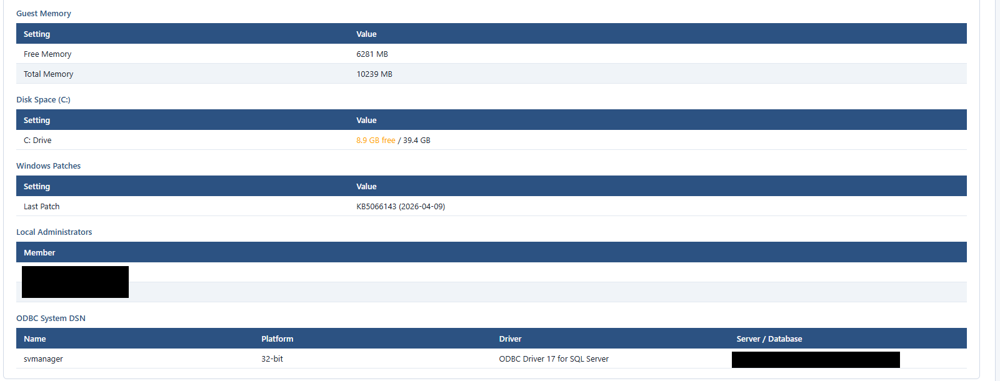
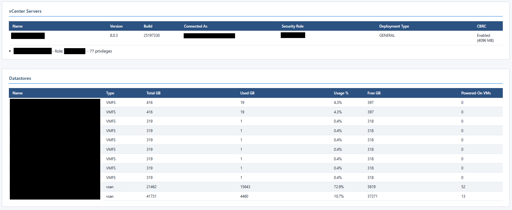
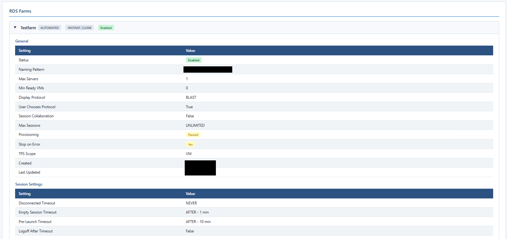
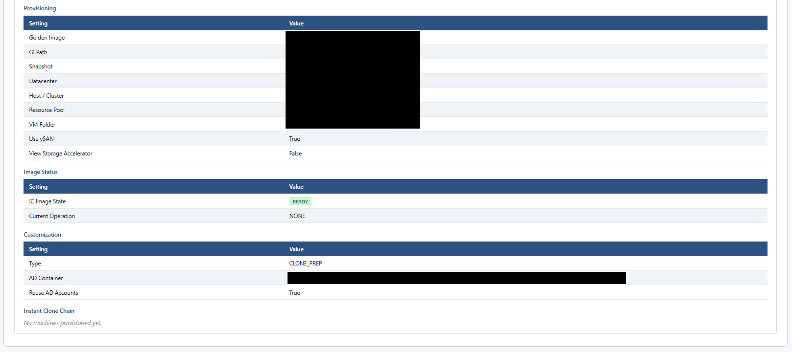
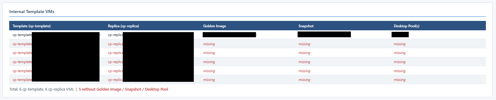
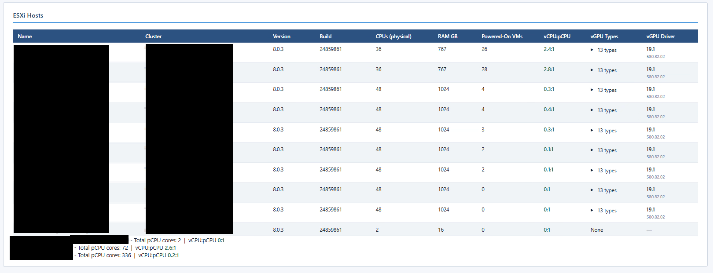
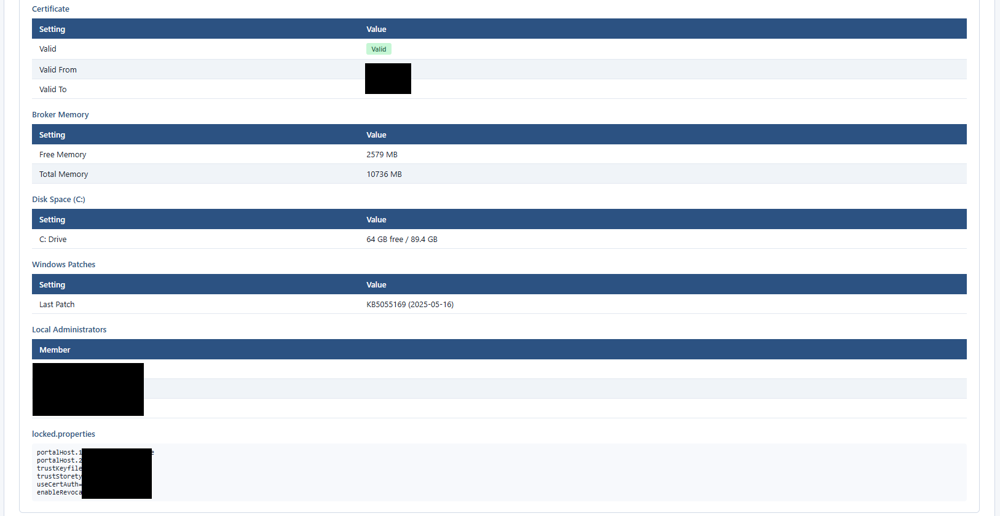

# Horizon Documentation Tool

A PowerShell-based WPF application that generates comprehensive HTML documentation of Omnissa Horizon VDI environments. Connect to a Horizon Connection Server, collect environment data via REST API and PowerCLI, and produce a self-contained HTML report — no additional frameworks required.


[](LICENSE)

---

## Report Gallery

<table>
  <tr>
    <td align="center" width="50%">
      
      <br><sub><b>Connection Servers</b> — Docu Tool Main Windows Horizon Tab</sub>
    </td>
    <td align="center" width="50%">
      
      <br><sub><b>Connection Servers</b> — Detail cards with version, status badges and certificate info</sub>
    </td>
  </tr>
  <tr>
    <td align="center" width="50%">
      
      <br><sub><b>App Volumes Configuration</b> — Applications, packages and user assignments</sub>
    </td>
    <td align="center" width="50%">
      
      <br><sub><b>App Volumes Manager</b> — Manager server details, storage and license info</sub>
    </td>
  </tr>
  <tr>
    <td align="center" width="50%">
      
      <br><sub><b>vCenter Servers & Datastores</b> — Capacity, usage and powered-on VM counts</sub>
    </td>
    <td align="center" width="50%">
      
      <br><sub><b>RDS Farms</b> — Farm configuration, session settings and provisioning status</sub>
    </td>
  </tr>
  <tr>
    <td align="center" width="50%">
      
      <br><sub><b>RDS Farms — Provisioning</b> — Golden Image path, IC chain state and customisation settings</sub>
    </td>
    <td align="center" width="50%">
      
      <br><sub><b>Internal Template VMs</b> — cp-template / cp-replica inventory with pool assignments</sub>
    </td>
  </tr>
  <tr>
    <td align="center" width="50%">
      
      <br><sub><b>ESXi Hosts</b> — Hardware specs, vCPU:pCPU ratios and vGPU driver info</sub>
    </td>
    <td align="center" width="50%">
      
      <br><sub><b>Connection Server Detail</b> — Memory, disk space, patches, local admins and ODBC config</sub>
    </td>
  </tr>
</table>

<p align="center">
  <a href="docs/screenshots/full-report-overview.jpeg">
    📄 View full report screenshot (all sections)
  </a>
</p>

---

## Key Features

### Unique Reporting Capabilities

> These are data points that are difficult or impossible to obtain from the Horizon Admin Console alone.

| Feature | Why it matters |
|---|---|
| **vCenter Role & full Permission listing** | Documents every privilege granted to the Horizon service account — essential for audits and least-privilege reviews |
| **ESXi vGPU — driver version & vGPU type** | Confirms GPU driver consistency across all hosts; catches version drift before it causes session failures |
| **vCPU:pCPU ratio per ESXi host & cluster** | Instant overcommit visibility — critical for performance capacity planning in VDI environments |
| **App Volumes database & certificate details** | Surfaces SQL connection strings, DB health, and TLS certificate expiry in one place |
| **Connection Server `locked.properties`** | Reads the file via PSRemoting and shows every hidden tuning parameter that is otherwise not visible in the Admin Console |
| **Desktop Pool overview incl. vGPU profile & Internal Templates** | One table showing pool type, vGPU profile, golden image, snapshot, and IC template chain — no more clicking through individual pools |
| **Full Internal Template VM listing** | Shows every cp-template and cp-replica with its pool association — spot orphaned or misconfigured templates immediately |
| **All Entitlements with member count** | Lists every entitled user/group with resolved member counts — directly usable for **Named User licence audits** |

### General Features

- **WPF GUI** — Modern dark-themed interface with credential management, connection testing, and progress tracking
- **Self-contained HTML reports** — Single-file output with embedded CSS, no external dependencies
- **PDF export** — Optional PDF generation via bundled wkhtmltopdf
- **Credential persistence** — DPAPI-encrypted credential storage (per-user, per-machine)
- **Portable PowerShell 7** — Bundled PS7 runtime, no system-wide installation needed
- **Modular architecture** — 30+ collectors and renderers, each in its own .ps1 file
- **App Volumes standalone mode** — Run without a Horizon Connection Server to document App Volumes infrastructure independently

## Documented Components

| Category | Data Collected |
|----------|---------------|
| **Connection Servers** | Version, status, certificates, replication partners, `locked.properties` |
| **Desktop Pools** | Configuration, vGPU profile, provisioning settings, entitlements, internal templates |
| **Application Pools** | Published apps, farm assignments, entitlements with member counts |
| **RDS Farms** | Farm topology, session settings, provisioning, IC chain |
| **Golden Images** | Base image inventory, snapshot chains |
| **Internal Template VMs** | cp-template / cp-replica inventory with pool assignments |
| **ESXi Hosts** | Hardware specs, vCPU:pCPU ratio, vGPU type & driver version |
| **vCenter** | Configuration, roles, full permission listing per service account |
| **UAG (Unified Access Gateway)** | Edge services, SSL certificates, health status |
| **App Volumes** | Applications, packages, assignments, writable volumes |
| **App Volumes Manager** | Server details, database config, certificates, ODBC, license & usage |
| **Entitlements** | All desktop & application entitlements with resolved member counts |
| **General Settings** | Global policies, environment properties, licence info |
| **Security** | SAML authenticators, TrueSSO config, AD domains, administrator permissions |
| **Infrastructure** | Datastores, gateways, gateway certificates, syslog config, event DB |
| **Cloud Pod Architecture** | CPA federation topology |

## Requirements

- **Windows 10/11** or **Windows Server 2016+**
- **Administrator privileges** (required for WMI queries and PSRemoting)
- **Network access** to the Horizon Connection Server (HTTPS port 443)
- Omnissa Horizon environment with REST API enabled

### Optional

- **vCenter credentials** — Enables PowerCLI-based VM inventory and IC chain lookup
- **Guest OS credentials** — Enables PSRemoting for locked.properties, local admins, disk space, patch info
- **UAG credentials** — Enables Unified Access Gateway data collection
- **App Volumes credentials** — Enables App Volumes API data collection

## Quick Start

### Option 1: Double-click launcher
```
HorizonDocTool.bat
```
The batch launcher automatically uses the bundled PowerShell 7 and requests admin elevation.

### Option 2: Run directly
```powershell
.\Tools\PowerShell-7.6.0-win-x64\pwsh.exe -NoProfile -ExecutionPolicy Bypass -File .\HorizonDocTool.ps1
```

### Usage

1. Enter the **Connection Server FQDN** and credentials (DOMAIN\username or username + domain field)
2. Optionally click **Test Connection** to verify connectivity
3. Fill in optional credentials (vCenter, Guest OS, UAG, App Volumes) for deeper data collection
4. Select an **output folder**
5. Optionally configure **Company Info** for the cover page
6. Select which sections to include via **Requirements** dialog
7. Click **Generate Report**

The tool generates a timestamped HTML file in your chosen output folder.

## Project Structure

```
HorizonDocTool.ps1              # Main application (1500+ lines, WPF orchestrator)
HorizonDocTool.bat              # Double-click launcher with admin elevation
Modules/
  Collectors/                   # 30 data collection modules (Get-Hzn*)
    Get-HznConnectionServers.ps1
    Get-HznDesktopPools.ps1
    Get-HznAppVolumesData.ps1
    Get-HznESXiHosts.ps1
    ...
  Renderers/                    # 33 HTML rendering modules (Render-*)
    HtmlHelpers.ps1             # Shared HTML/CSS helper functions
    Render-Report.ps1           # Master report assembly
    Render-CoverPage.ps1
    Render-ConnectionServers.ps1
    Render-DesktopPools.ps1
    ...
  UI/                           # WPF interface components
    Theme.ps1                   # Dark theme color constants
    WindowXaml.ps1              # Main window XAML definition
    CompanyInfoDialog.ps1       # Company info input dialog
    RequirementsDialog.ps1      # Section selection dialog
    VmStartConfirmDialog.ps1    # VM start confirmation
  RestHelpers.ps1               # Horizon REST API wrapper functions
  RunspaceHelpers.ps1           # Background thread logging
Omnissa Horizon Modules/        # Bundled Omnissa PowerShell modules
  Omnissa.VimAutomation.HorizonView/
  Omnissa.Horizon.Helper/
VMware PowerCLI Modules/        # Bundled VMware PowerCLI (portable)
  VMware.VimAutomation.Core/
  VMware.Vim/
  ...
Tools/
  PowerShell-7.6.0-win-x64/    # Bundled portable PowerShell 7
  wkhtmltopdf/                  # PDF export engine
  check_deps.ps1                # Dependency verification script
  Test-UagLogin.ps1             # UAG authentication test utility
```

## Architecture

The application follows a modular collector/renderer pattern:

1. **Collectors** (`Modules/Collectors/Get-Hzn*.ps1`) query the Horizon REST API, PowerCLI, and PSRemoting to gather environment data
2. **Renderers** (`Modules/Renderers/Render-*.ps1`) transform collected data into HTML sections
3. **Report assembly** (`Render-Report.ps1`) combines all sections into a single self-contained HTML file
4. **UI layer** (`Modules/UI/`) provides the WPF interface with connection management and progress tracking

Report generation runs in a background runspace to keep the UI responsive. Collectors execute sequentially with progress updates; each collector gracefully handles missing permissions or connectivity issues.

## Configuration

Settings are stored in `%APPDATA%\HorizonDocTool\settings.json`:
- Last used server, username, domain
- Optional credential storage (DPAPI-encrypted)
- Output folder preference
- PDF export and auto-open preferences
- Company information for cover page

## Standalone App Volumes Mode

The tool can run in **App Volumes standalone mode** — enter only the App Volumes Manager FQDN and credentials (skip the Connection Server). This generates documentation for App Volumes infrastructure independently of a Horizon environment.

## Security Notes

- Credentials are transmitted over HTTPS only
- Stored passwords use Windows DPAPI encryption (bound to the current user and machine)
- SSL certificate validation can be optionally disabled for lab environments
- No credentials are written to the report output
